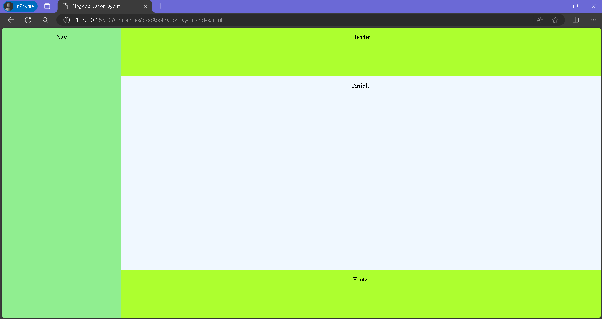

# BlogAppLayoutContent-1
 

  

  <h3 align="center">A Blog Application Content Page Layout</h3>

## About The Project

A basic Blog Application Content Page Layout with 4 sections - Nav, Header, Article & Footer.
 
 

 
 
## Built With
* HTML
* CSS

## Author

* **Zunaid Hossain** - *A Tech Enthusiast* - [Connect with me on LinkedIn](https://www.linkedin.com/in/zunaid-hossain-70b891235/)
